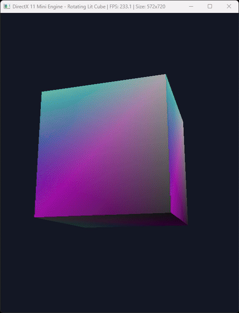

# DirectX 11 Mini Engine - Rotating Lit Cube (C++) Demo

## Description

This project demonstrates a **minimal modular DirectX 11 rendering engine written in C++** that renders a rotating cube with lighting.

The goal of the project is to provide a **clean, educational example of a DirectX 11 rendering pipeline** that can be used for learning graphics programming or as a starting point for small rendering engines.

This project illustrates:

- creation of a Win32 window
- DirectX 11 device and swap chain initialization
- shader compilation and usage (HLSL)
- rendering a rotating cube
- directional and point lighting
- basic engine‑style project structure

### Demo / Preview



Optional preview video:

<video src="docs/demo.mp4" controls width="700"></video>

Example visual outputs:

- rotating lit cube
- dynamic lighting
- rendering updates during window resize
- real‑time frame updates

---

## Properties / Specifications

- Language: C++
- Graphics API: DirectX 11
- Platform: Windows
- Rendering Features: 3D rendering, lighting, animation
- Architecture: modular renderer + scene system
- Build System: Visual Studio

---

## Requirements

### Hardware

Recommended hardware:

- GPU supporting DirectX 11+
- 4GB RAM minimum
- modern multi‑core CPU

### Software

Required software:

- Windows 10 or newer
- DirectX runtime
- Visual Studio 2019 / 2022
- Windows SDK

### IDE

Recommended development environment:

- Visual Studio Community 2022

Optional tools:

- Git
- PIX for Windows
- DirectX Graphics Debugger

---

## Installation

Steps to run the project:

1. Clone the repository
2. Open the project in Visual Studio
3. Build the project
4. Run the executable

Example:

```
git clone https://github.com/AhmadrezaRazian/DirectX11-Mini-Engine-Rotating-Lit-Cube-Cpp-Demo.git
```

---

## Configuration

Some configuration steps may be required depending on the system.

Common configurations:

- ensure the **Shaders/** directory is accessible at runtime
- set the **working directory** to the project folder
- ensure DirectX libraries are linked correctly

Example configuration:

Project Properties → Debugging → Working Directory

```
$(ProjectDir)
```

Required DirectX libraries:

```
d3d11.lib
dxgi.lib
d3dcompiler.lib
```

---

## Project Structure

```
DirectX11-Mini-Engine-Rotating-Lit-Cube-Cpp-Demo/
│
├─ main.cpp
│
├─ Core/
│   ├─ Window.cpp
│   └─ Window.h
│
├─ Renderer/
│   ├─ Renderer.cpp
│   └─ Renderer.h
│
├─ Graphics/
│   ├─ Mesh.cpp
│   ├─ Mesh.h
│   ├─ Shader.cpp
│   ├─ Shader.h
│   ├─ Camera.h
│   └─ Light.h
│
├─ Math/
│   └─ Transform.h
│
└─ Shaders/
    ├─ BasicVS.hlsl
    └─ BasicPS.hlsl
```

---

## Summary of Classes and Files

### Core

Handles **window creation and operating system interaction**.

### Renderer

Responsible for:

- DirectX device initialization
- swap chain creation
- rendering pipeline setup
- frame rendering

### Graphics

Contains core graphics objects:

- mesh data
- shader management
- camera system
- lighting structures

### Math

Utility structures for:

- transformations
- matrices
- object positioning

### Shaders

GPU shader programs written in **HLSL**.

### Entry Point

`main.cpp` starts the application and runs the rendering loop.

---

## Rendering / System Pipeline

```
Application
   ↓
Window System
   ↓
Renderer
   ↓
Camera + Scene
   ↓
Shaders
   ↓
GPU
   ↓
Screen Output
```

---

## Possible Errors

Common issues:

### Shader compilation failure

Cause:

- shader file not found
- incorrect shader path

Solution:

- ensure shaders exist inside the **Shaders/** directory

### DirectX initialization problems

Possible causes:

- unsupported GPU
- missing DirectX runtime

### Incorrect working directory

Fix by setting:

```
$(ProjectDir)
```

### Unsupported GPU features

Ensure GPU supports **DirectX 11**.

---

## Limitations

Current limitations of the demo:

- single object rendering
- no texture system yet
- limited camera controls
- no physics system

---

## Next Steps / Future Work

Possible improvements:

- camera movement controls
- texture and material system
- multiple mesh rendering
- shadow mapping
- GUI overlay
- performance profiling

---

## Contributing

Contributions are welcome.

Typical workflow:

- fork the repository
- create a feature branch
- submit a pull request

Constructive feedback and improvements are encouraged.

---

## License

MIT License.

---

## Contact

If you have any questions or want to collaborate on projects, feel free to reach out.  
Do not hesitate to comment or submit PRs.

Sayed Ahmadreza Razian  
AhmadrezaRazian@gmail.com  
https://www.linkedin.com/in/ahmadrezarazian/
